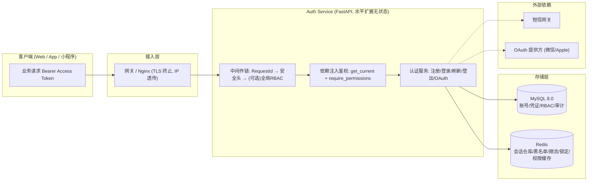
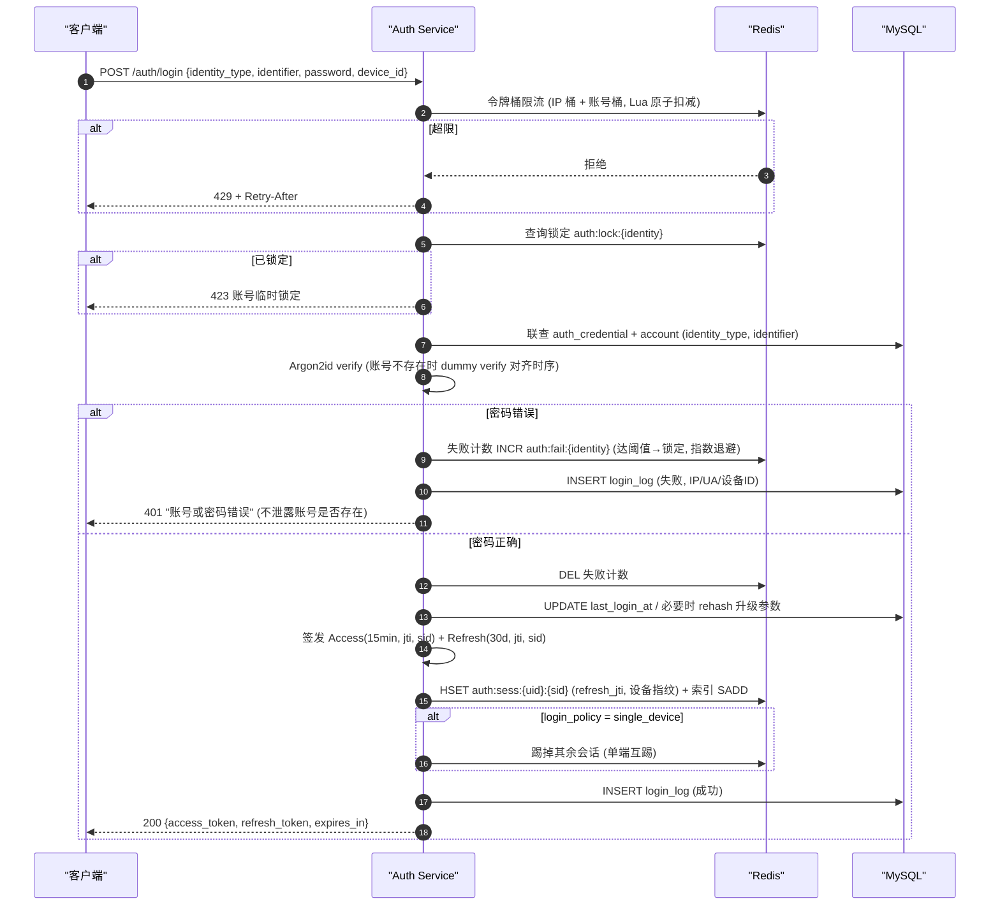
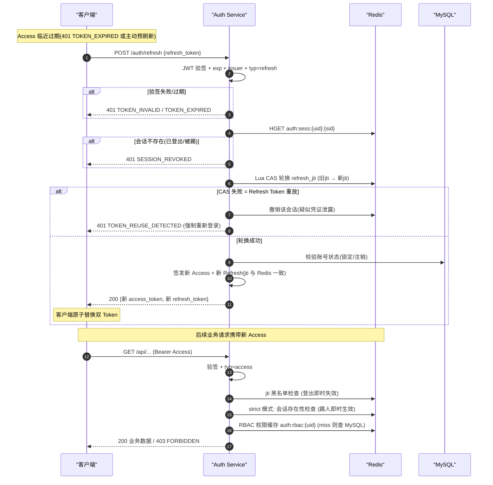

# User & Auth Service — 架构与数据流转

## 1. 总体架构

## 2. 登录时序图(含风控链)

## 3. 双 Token 无感续期时序图(轮换 + 重放检测)

## 4. 登出 / 改密 / 踢人

| 场景 | 动作 | 生效时机 |
|---|---|---|
| 登出当前端 | Access jti 入黑名单(TTL=剩余寿命) + 删除会话 | 即时 |
| 全端登出 | 黑名单 + 枚举 sess-idx 删除全部会话 | 即时 |
| 修改密码 | 更新 Argon2id 哈希 + 撤销全部会话 | 即时, 强制重新登录 |
| 单端互踢登录 | 新会话创建后删除其余 sid | 即时(strict_session_check) |
| 角色变更 | 删除 auth:rbac:{uid} 缓存 | ≤ 缓存 TTL 生效 |
