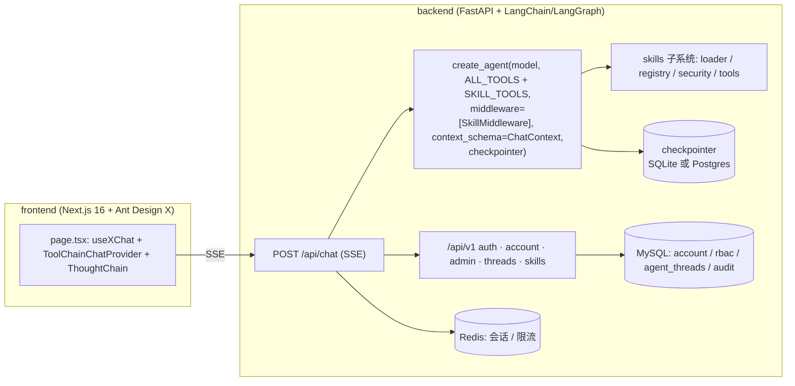
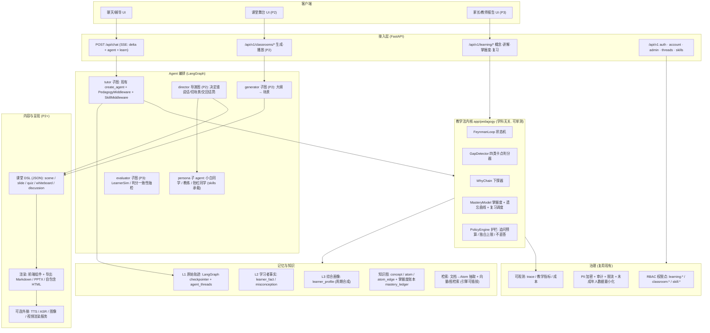
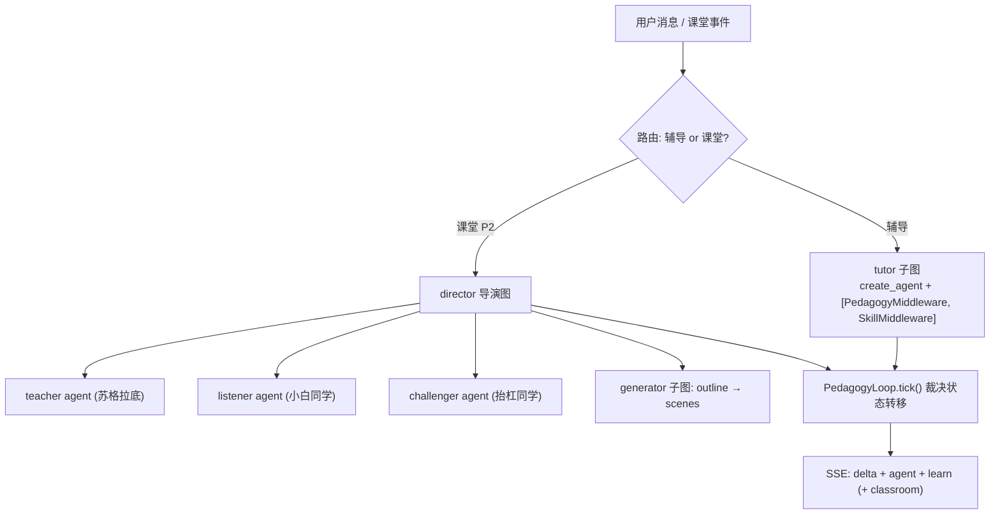

# 目标架构与现有代码的映射

配套文档：[vision](./education-agent-vision.md)（为什么）、[pedagogy-core](./pedagogy-core.md)（内核规格）、
[roadmap](./education-agent-roadmap.md)（分阶段落地）。本文回答：**代码要怎么长出来**。

写作前提（仓库既有约束，必须尊重）：

- `get_agent()` 是进程级单例，system prompt 与工具集在构造期固定；
  **任何按用户/按请求的差异只能走 `context` + middleware**（见 `backend/app/context.py` 注释）。
- LangChain 1.x 不允许 middleware 运行时新增未注册工具，只能把工具**收敛成子集**
  （`request.override(tools=...)`）—— 这条限制正好被我们改造成「掌握度门控」。
- 表结构变更走 Alembic（`backend/alembic/versions/`），`backend/migrations/` 只做全新库引导。
- 所有 `uv` 命令在本机必须带 `UV_DEFAULT_INDEX=https://pypi.org/simple/` 前缀，提交前检查 `uv.lock` 无镜像地址。
- 新功能必须有 pytest 用例，`tests/conftest.py` 已把 MySQL/Redis/LLM 冻结为 mock。

---

## 1. 现状架构（基线）



问题（对教育场景而言）：没有学习者模型、没有教学状态、没有知识图、没有评估；
`agent_threads` 只存元数据，checkpointer 里的对话是**不可聚合的黑箱**。

---

## 2. 目标架构



分层原则：**内核（Core）不依赖 LLM 也能跑状态机**；LLM 只在判分器与生成器边界被调用，
且接口化（可注入假模型），这样 `MockChatModel` 与 pytest 能覆盖全部转移逻辑。

---

## 3. 模块与文件树（新增部分）

```
backend/
├── app/
│   ├── pedagogy/                  # 新增：教学法内核（学科无关，纯逻辑 + 判分接口）
│   │   ├── __init__.py
│   │   ├── states.py              #   费曼循环状态枚举 + 转移表（pedagogy-core §1）
│   │   ├── loop.py                #   FeynmanLoop.tick(event) -> Effect（不发 HTTP、不查库）
│   │   ├── gaps.py                #   GapDetector：讲解 → claims → 四类卡点（结构化输出）
│   │   ├── whychain.py            #   下探器：断言 → 依赖 → 落点 kind 判定
│   │   ├── mastery.py             #   掌握度更新 / 衰减 / 复习调度（纯函数，易测）
│   │   ├── policy.py              #   护栏：追问预算、独白上限、不直答、逃生舱
│   │   └── schemas.py             #   ExplanationTurn / GapReport / AtomBundle / PedagogyState
│   ├── knowledge/                 # 新增：Atom / Concept 图与检索
│   │   ├── graph.py               #   子图裁剪（只把当前概念相关 Atom 交给模型）
│   │   ├── ingest.py              #   文档/材料 → Atom 抽取（P1 最小版，P3 多引擎）
│   │   └── retrieval.py           #   可插拔检索引擎接口（先内置，后可接 LightRAG/GraphRAG）
│   ├── memory/                    # 新增：三层记忆
│   │   ├── l2_facts.py            #   学习者事实 / 误解库的写入与摘要
│   │   ├── l3_profile.py          #   周期合成画像（异步任务）
│   │   └── digest.py              #   给 middleware 用的带预算摘要渲染
│   ├── classroom/                 # 新增（P2）：课堂生成与播放
│   │   ├── dsl.py                 #   课堂 DSL 的 pydantic 模型 + 校验
│   │   ├── outline.py             #   阶段一：大纲生成
│   │   ├── scenes.py              #   阶段二：场景生成（slide/quiz/whiteboard/discussion）
│   │   ├── director.py            #   LangGraph 导演图：轮次与场景调度
│   │   └── export.py              #   Markdown / PPTX / 自包含 HTML 导出
│   ├── middleware/
│   │   ├── agent_skills.py        # 现有：技能目录注入 + 工具收敛
│   │   └── agent_pedagogy.py      # 新增：教学状态注入 + 掌握度门控 + 输出护栏
│   ├── models/                    # 新增表（见 §4）
│   ├── services/
│   │   ├── learning_service.py    # 新增：概念/讲解/掌握度/复习的业务编排
│   │   └── classroom_service.py   # 新增（P2）
│   ├── api/v1/
│   │   ├── learning.py            # 新增
│   │   └── classrooms.py          # 新增（P2）
│   └── context.py                 # 扩展 ChatContext: learner_id / pedagogy_state
├── skills/                        # 教学法与学科内容（数据，不是代码）
│   ├── feynman-tutor/SKILL.md     # 新增：费曼循环 SOP（persona: 教练）
│   ├── feynman-listener/SKILL.md  # 新增：小白同学 persona
│   ├── boundary-challenger/SKILL.md # 新增：抬杠同学 persona
│   ├── first-principles-drill/SKILL.md # 新增：Why-chain 下探 SOP
│   └── subject-*/SKILL.md         # P3：学科技能包（数学/物理/编程/英语…）
├── evals/                         # 新增：评估闭环
│   ├── learner_sim/               #   profile-driven student simulator
│   ├── datasets/                  #   讲解样本 + 人工标注（判分一致性）
│   └── run_eval.py                #   Gap Closure Rate / 直答率 / κ 报告
└── tests/
    ├── test_pedagogy_loop.py      # 状态机转移（不经 LLM）
    ├── test_pedagogy_gaps.py      # 卡点判分（注入假模型）
    ├── test_mastery.py            # 掌握度纯函数
    ├── test_learning_api.py       # HTTP + RBAC
    └── test_classroom_*.py        # P2
frontend/src/
├── app/
│   ├── page.tsx                   # 现有聊天页：新增 learn 事件渲染
│   ├── learn/                     # 新增：概念图 / 掌握度账本 / 复习队列
│   ├── classroom/[id]/            # 新增（P2）：课堂舞台
│   └── report/                    # 新增（P3）：家长/教师报告（权限门禁）
└── src/lib/learning-provider.ts   # 新增：ToolChainChatProvider 的同构扩展，累积 learn 事件
```

**复用优先**：`skills/` 承载教学法（不改代码即可迭代提示词与 SOP）、
`SkillMiddleware` 的工具收敛机制承载掌握度门控、`agent_threads` + checkpointer 承载 L1 记忆、
RBAC 承载角色与报告门禁。新增代码集中在 `app/pedagogy/`、`app/knowledge/`、`app/memory/`。

---

## 4. 数据模型（新增表，DDL 草图）

命名沿用现有风格（BigInteger 主键、`created_at/updated_at` server_default、中文 comment）。
所有变更走 Alembic 迁移，并同步 `backend/migrations/002_seed_rbac.sql` 里的权限点。

```sql
-- 概念与知识原子（学科无关的图结构）
CREATE TABLE learning_concept (
  id            BIGINT PRIMARY KEY AUTO_INCREMENT,
  slug          VARCHAR(128) NOT NULL UNIQUE COMMENT '概念标识, 如 attention-scaled-dot-product',
  title         VARCHAR(255) NOT NULL,
  subject       VARCHAR(64)  NULL COMMENT '学科标签, 仅用于筛选, 不参与内核逻辑',
  scope         TEXT         NULL COMMENT '范围边界: 明确不讨论什么',
  summary       TEXT         NULL,
  created_at    DATETIME DEFAULT CURRENT_TIMESTAMP
) COMMENT='概念节点';

CREATE TABLE learning_atom (
  id            BIGINT PRIMARY KEY AUTO_INCREMENT,
  atom_key      VARCHAR(191) NOT NULL UNIQUE COMMENT '稳定标识 atom:xxx',
  concept_id    BIGINT NOT NULL,
  statement     TEXT NOT NULL COMMENT '不可再分的最小命题',
  kind          VARCHAR(16) NOT NULL COMMENT 'definition|axiom|observable|derivable',
  source_title  VARCHAR(255) NULL,
  source_locator VARCHAR(255) NULL COMMENT '章节/页码/时间戳',
  source_url    VARCHAR(1024) NULL,
  verified      TINYINT(1) NOT NULL DEFAULT 0 COMMENT '未溯源不得进入掌握度记账',
  difficulty    TINYINT NOT NULL DEFAULT 2 COMMENT '1-5, 出题难度校准用',
  created_at    DATETIME DEFAULT CURRENT_TIMESTAMP,
  KEY idx_atom_concept (concept_id)
) COMMENT='知识原子';

CREATE TABLE learning_atom_edge (
  id            BIGINT PRIMARY KEY AUTO_INCREMENT,
  from_atom_id  BIGINT NOT NULL,
  to_atom_id    BIGINT NOT NULL,
  relation      VARCHAR(16) NOT NULL COMMENT 'depends_on|entails|contradicts',
  weight        DECIMAL(4,3) NOT NULL DEFAULT 1.000 COMMENT '关键边权重更高',
  UNIQUE KEY uk_edge (from_atom_id, to_atom_id, relation)
) COMMENT='原子依赖边(第一性原理的图化身)';

-- 学习证据与账本
CREATE TABLE learner_explanation (
  id            BIGINT PRIMARY KEY AUTO_INCREMENT,
  account_id    BIGINT NOT NULL,
  thread_id     VARCHAR(64) NULL COMMENT '关联 LangGraph thread',
  concept_id    BIGINT NOT NULL,
  loop_index    TINYINT NOT NULL DEFAULT 1,
  state         VARCHAR(16) NOT NULL COMMENT 'Pick|Teach|Detect|Return|Simplify|Closed|Escaped',
  raw_text      MEDIUMTEXT NOT NULL COMMENT '学习者原话, 不加工',
  claims_json   JSON NOT NULL COMMENT '命题拆解 + status',
  gap_report_json JSON NULL COMMENT '四类卡点 + probe + supply',
  learner_talk_ratio DECIMAL(4,3) NULL,
  created_at    DATETIME DEFAULT CURRENT_TIMESTAMP,
  KEY idx_expl_account (account_id, concept_id, created_at)
) COMMENT='讲解证据(费曼循环的原始产物)';

CREATE TABLE mastery_ledger (
  id            BIGINT PRIMARY KEY AUTO_INCREMENT,
  account_id    BIGINT NOT NULL,
  atom_id       BIGINT NOT NULL,
  mastery       DECIMAL(5,4) NOT NULL DEFAULT 0.0000,
  evidence_count INT NOT NULL DEFAULT 0,
  last_evidence_at DATETIME NULL,
  next_review_at DATETIME NULL COMMENT '间隔重复调度',
  review_stage  TINYINT NOT NULL DEFAULT 0 COMMENT '1/3/7/21/60 天阶梯下标',
  updated_at    DATETIME DEFAULT CURRENT_TIMESTAMP ON UPDATE CURRENT_TIMESTAMP,
  UNIQUE KEY uk_mastery (account_id, atom_id)
) COMMENT='掌握度账本: 每条边一行, 可回溯证据';

CREATE TABLE learner_fact (            -- L2：结构化学习者事实
  id            BIGINT PRIMARY KEY AUTO_INCREMENT,
  account_id    BIGINT NOT NULL,
  kind          VARCHAR(32) NOT NULL COMMENT 'misconception|preference|language_level|strategy',
  concept_id    BIGINT NULL,
  atom_id       BIGINT NULL,
  statement     TEXT NOT NULL,
  evidence_explanation_id BIGINT NULL COMMENT 'Memory Graph: L2 事实 → L1 证据',
  confidence    DECIMAL(4,3) NOT NULL DEFAULT 0.500,
  superseded_by BIGINT NULL COMMENT '事实被修正时指向新事实, 不物理删除',
  created_at    DATETIME DEFAULT CURRENT_TIMESTAMP,
  KEY idx_fact_account (account_id, kind)
) COMMENT='L2 学习者事实(含误解库)';

CREATE TABLE learner_profile (         -- L3：周期合成的画像
  id            BIGINT PRIMARY KEY AUTO_INCREMENT,
  account_id    BIGINT NOT NULL,
  digest        TEXT NOT NULL COMMENT '带 token 预算的画像摘要, 供 middleware 注入',
  source_fact_ids JSON NOT NULL COMMENT 'Memory Graph: L3 综合 → 贡献的 L2 事实',
  generated_at  DATETIME DEFAULT CURRENT_TIMESTAMP,
  UNIQUE KEY uk_profile (account_id)
) COMMENT='L3 学习者画像综合';

-- P2：课堂
CREATE TABLE classroom (
  id            BIGINT PRIMARY KEY AUTO_INCREMENT,
  uuid          CHAR(36) NOT NULL UNIQUE,
  owner_id      BIGINT NOT NULL,
  title         VARCHAR(255) NOT NULL,
  topic         TEXT NOT NULL,
  status        VARCHAR(16) NOT NULL DEFAULT 'draft' COMMENT 'draft|outlining|generating|ready|failed',
  outline_json  JSON NULL,
  dsl_json      MEDIUMTEXT NULL COMMENT '课堂 DSL(场景数组)',
  concept_ids   JSON NULL,
  created_at    DATETIME DEFAULT CURRENT_TIMESTAMP,
  updated_at    DATETIME DEFAULT CURRENT_TIMESTAMP ON UPDATE CURRENT_TIMESTAMP
) COMMENT='课堂(两阶段生成产物)';

CREATE TABLE classroom_event (         -- 课堂回放与学习证据的来源
  id            BIGINT PRIMARY KEY AUTO_INCREMENT,
  classroom_id  BIGINT NOT NULL,
  seq           INT NOT NULL,
  actor         VARCHAR(32) NOT NULL COMMENT 'teacher|peer|challenger|learner',
  action        VARCHAR(32) NOT NULL COMMENT 'speak|whiteboard|quiz|highlight|handover',
  payload_json  JSON NOT NULL,
  created_at    DATETIME DEFAULT CURRENT_TIMESTAMP,
  UNIQUE KEY uk_event (classroom_id, seq)
) COMMENT='课堂动作流(可回放, 可导出)';
```

新增 RBAC 权限点（照抄 `9c4a1f7b2d65` 的播种方式）：
`learning:self:read`、`learning:explanation:write`、`learning:report:read`（家长/教师）、
`learning:atom:admin`（维护知识图）、`classroom:create`、`classroom:publish`、
以及每个 gated 技能对应的 `skill:<name>:use`。

---

## 5. 记忆三层与 checkpointer 的关系

借 DeepTutor 的 L1/L2/L3 + Memory Graph，但**不重造 L1**：

| 层 | 内容 | 载体 | 写入时机 | 读取方 |
|---|---|---|---|---|
| L1 | 原始对话与工具调用轨迹 | LangGraph checkpointer（SQLite/Postgres）+ `agent_threads` 元数据 + `learner_explanation.raw_text` | 每轮 | 回放、审计、L2 合成 |
| L2 | 结构化学习者事实（误解、偏好、语言水平、策略） | `learner_fact` | 每次 gap 判定闭合/失败后 | `PedagogyMiddleware` 注入摘要（带 token 预算） |
| L3 | 综合画像 | `learner_profile` | 异步周期任务（如每 20 次循环或每日） | system 层个性化、报告页 |

Memory Graph 的边就是外键：`learner_fact.evidence_explanation_id → L1`，
`learner_profile.source_fact_ids → L2`。**画像里的每句话都能点回证据** —— 这是对家长/教师可信的前提，
也是 vision §6「掌握度账本」的落点。

上下文预算沿用 skills 的三级披露思想（`SKILL_MAX_*`）：
`PEDAGOGY_MAX_DIGEST_CHARS`（默认 1200）、`PEDAGOGY_MAX_ATOMS_IN_CONTEXT`（默认 20）。

---

## 6. Agent 编排：从单 agent 到 LangGraph 多子图

现状：一个 `create_agent` 单例 + `SkillMiddleware`。
目标（渐进，不推倒重来）：



要点：

1. **导演图不生成教学内容，只调度**：决定「谁说话、说多久、什么时候把话筒交回学习者」。
   学习者说话占比是导演图的硬目标函数（`learner_talk_ratio ≥ 0.5`），
   这是 OpenMAIC「多智能体课堂」与我们的关键区别 —— 课堂不是为了热闹，是为了产出证据。
2. **persona 用 skills 承载**，不是三份硬编码提示词：可版本化、可 A/B、可对外发布。
3. **裁决权在内核**：LLM 输出必须经 `PolicyEngine` 过滤（截断独白、抑制超额追问、拦截直答）。
   模型不听话时，系统行为仍然正确 —— 这是「控制流而非提示词」的工程含义。
4. 单例约束不变：所有子图共享一个进程内 agent 构造，差异走 `context`。

---

## 7. 课堂 DSL 与呈现层（P2，借 OpenMAIC）

两阶段生成（与 OpenMAIC 的 outline → scenes 同构，但场景类型收敛）：

| 场景类型 | 我们的最小实现 | 明确后置 |
|---|---|---|
| `slide` | Markdown/JSON 讲义页 + 讲解脚本 | Canvas 编辑器、PPTX 精修 |
| `quiz` | 单选/多选/简答 + **归因判分**（复用 GapDetector） | 题库管理、难度自适应引擎 |
| `whiteboard` | 文本/SVG 指令流（画公式、画流程图），前端渲染 | 28+ 动作引擎、实时协作 |
| `discussion` | 多 persona 轮次 + 学习者插入点 | 圆桌辩论语音、TTS/ASR |
| `interactive` | 单个自包含 HTML（可选，沙箱渲染） | 3D、模拟实验、游戏 |
| `pbl` | 角色 + 里程碑 + 交付物清单（Markdown） | 职业任务引擎 |

导出：Markdown（P2 必做）→ 自包含 HTML（P2 可选）→ PPTX（P3，可用 python-pptx）。
**不做** MP4 渲染服务（需要独立 Chromium+FFmpeg 容器，投入产出比最差）。

---

## 8. 前端演变

| 现有 | 演变 |
|---|---|
| `ToolChainChatProvider` 累积 `agent` 工具链事件 → `ThoughtChain` | 同构新增 `learn` 事件累积 → **学习证据面板**：当前状态、本轮卡点、掌握度增量、下次复习 |
| `XMarkdown` 流式渲染 + `ThinkComponent` | 新增 Atom 卡片组件（命题 + 来源 + 是否已验证）、gap 高亮（把学习者原话中的断裂处标出来） |
| 会话侧栏（`useXConversations`） | 侧栏增加「学习」入口：概念图（Atom DAG 可视化）、复习队列、掌握度账本 |
| `/settings`、`/users` | `/learn`（学习者）、`/report`（家长/教师，权限门禁）、`/classroom/[id]`（P2 舞台） |

前端无测试运行器，验收仍是 `pnpm lint` + `pnpm build` + 手动走通流程（见 `AGENTS.md`）。
注意 `frontend/AGENTS.md` 的 Next.js 16 破坏性变更提醒。

---

## 9. 治理、安全与合规

| 主题 | 复用现有 | 新增要求 |
|---|---|---|
| 角色 | account ↔ role ↔ permission、`require_permissions` | 学生 / 家长 / 教师 / 管理员四角色；家长-学生绑定关系表（P3） |
| 报告访问 | 404 而非 403 的防枚举策略（skills 已有） | 报告接口同样处理；跨账号访问一律 404 |
| 未成年人数据 | PII 字段加密（AES-256-GCM + HMAC 盲索引）、审计 | 数据最小化：画像只存学习相关字段；提供导出与删除；`raw_text` 保留期可配 |
| 注入防护 | `security.wrap_untrusted`（技能附件视为不可信数据） | 学习者上传材料、外部检索结果一律同等处理；Atom `source_url` 走 SSRF 防护 |
| 限流与成本 | Redis 令牌桶（按账号/IP） | 增加「每账号每日教学循环数 / token 预算」维度 |
| 审计 | `audit_service` | 掌握度变更、直答逃生舱使用、报告访问必须留痕 |

---

## 10. 可观测性与评估闭环

- **Trace**：每次循环产出一条 `pedagogy_trace`（状态序列、gap 类型分布、追问数、learner_talk_ratio、token 成本），
  结构化落库（可先用日志 + `learner_explanation`，P3 独立表）。
- **指标**：vision §8 的三层指标全部从 trace 聚合，接现有 `/api/health` 之外的
  `GET /api/v1/admin/metrics/learning`（`skill:admin` 级别权限或新 `metrics:read`）。
- **评估**：`backend/evals/`（LearnerSim + 人工标注集）在 CI 里以「小样本冒烟」形式跑，
  完整评估离线跑；**判分器版本变更必须附一致性报告**，否则不允许合入。
- **回归护栏**：教学策略是易碎品，任何 prompt / skill / 阈值改动都要跑 LearnerSim 回归，
  对比 Gap Closure Rate 与直答率，劣化即阻断。

---

## 11. 复用 vs 新增（一页速查）

| 目标能力 | 复用什么 | 新增什么 |
|---|---|---|
| 辅导对话流 | `POST /api/chat` SSE + `agent` 事件模式 | `learn` 事件字段 |
| 教学状态机 | — | `app/pedagogy/loop.py` + `middleware/agent_pedagogy.py` |
| 掌握度门控 | `request.override(tools=...)` 子集收敛（SkillMiddleware 已验证可行） | 按 `mastery_ledger` 计算可见工具/技能子集 |
| 教学法与学科内容 | skills 三级渐进披露 + 热加载 + RBAC 可见性 | `skills/feynman-*`、`skills/subject-*` |
| L1 记忆 | checkpointer（SQLite/Postgres）+ `agent_threads` | `learner_explanation` 结构化落库 |
| L2/L3 记忆与画像 | SQLAlchemy async + Alembic | `learner_fact` / `learner_profile` + 异步合成任务 |
| 知识图 | — | `learning_concept` / `learning_atom` / `learning_atom_edge` + `app/knowledge/` |
| 多智能体课堂 | LangGraph（已是依赖） | director 子图 + persona skills + `classroom*` 表 |
| 角色与合规 | RBAC / PII 加密 / 审计 / 限流 | 新权限点 + 家长-学生绑定 + 保留期策略 |
| 评估 | pytest + `conftest.py` 冻结外部依赖 + `MockChatModel` | `backend/evals/`（LearnerSim + 标注集 + 报告） |
| 前端证据可视化 | `ToolChainChatProvider` / `ThoughtChain` / `XMarkdown` | learn 事件累积 + Atom/gap 组件 + `/learn`、`/report` |
