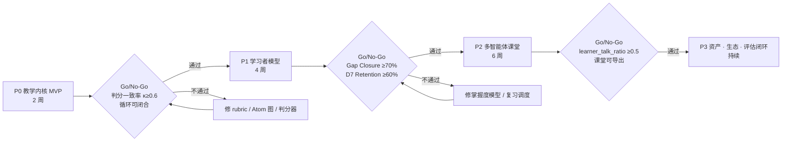

# 演进路线图（Roadmap）

配套：[vision](./education-agent-vision.md) · [pedagogy-core](./pedagogy-core.md) · [architecture](./education-agent-architecture.md)。

## 0. 演进原则

1. **每阶段独立可交付、可演示、可回退**：不存在「必须全做完才能看到价值」的阶段。
2. **一个功能 = 一次绿色提交**：遵循 `AGENTS.md` 的「测试 → 检查 → 单独提交」，
   后端 `uv run ruff check .` + `uv run pytest -q`，前端 `pnpm lint` + `pnpm build`；
   本机 `uv` 一律带 `UV_DEFAULT_INDEX=https://pypi.org/simple/`。
3. **内核先于呈现**：诊断/证据/掌握度没被验证之前，不投入 3D、视频、TTS 等呈现层（vision §5 不做清单）。
4. **阈值与提示词一律配置化或技能化**：`PEDAGOGY_*` 环境变量 + `skills/*/SKILL.md`，
   避免「改一句话就要改代码」。
5. **门控推进**：每阶段末尾有 Go/No-Go 指标，不达标就停下来修内核，而不是往下堆功能。

---

## P0 · 教学内核 MVP（约 2 周）

**目标**：证明「一次完整的费曼循环」能跑通并产出结构化证据 —— 这是全部价值的最小证明。

### 交付物（建议的提交序列）

| # | 提交 | 内容 | 测试 |
|---|---|---|---|
| 1 | `Add pedagogy state machine and schemas` | `app/pedagogy/{states,loop,schemas}.py`：七态 + 转移表 + `tick()` 纯函数 | `tests/test_pedagogy_loop.py`：每条转移 + 预算护栏，不经 LLM |
| 2 | `Add gap taxonomy detector` | `app/pedagogy/gaps.py`：讲解 → claims → 四类卡点，结构化输出（温度 0），判分接口可注入 | `tests/test_pedagogy_gaps.py`：四类各 ≥2 个样例（假模型固定输出） |
| 3 | `Add mastery model with spaced review` | `app/pedagogy/mastery.py`：更新/衰减/复习阶梯（纯函数） | `tests/test_mastery.py`：数值断言 + 单调性 |
| 4 | `Add learning tables and migrations` | `learning_concept` / `learning_atom` / `learning_atom_edge` / `learner_explanation` / `mastery_ledger` + Alembic 迁移 + 权限点播种 | `tests/test_migrations.py` 扩展（现有测试已守迁移一致性） |
| 5 | `Add feynman tutor skills` | `skills/feynman-tutor/`、`skills/feynman-listener/`、`skills/first-principles-drill/` 的 `SKILL.md` + `references/` | `tests/test_skills*.py` 风格：加载 / 可见性 / 门禁三条 |
| 6 | `Inject pedagogy state via middleware` | `app/middleware/agent_pedagogy.py` + `ChatContext` 扩展；`learn` SSE 事件 | `tests/test_chat_api.py` 扩展：断言 `learn` 事件形状；只读 delta 的客户端不受影响 |
| 7 | `Add learning API` | `/api/v1/learning/{concepts,explanations,mastery,review-queue}` | `tests/test_learning_api.py`：本人可见 / 他人 404 / 未登录 401 |
| 8 | `Extend mock model with a feynman script` | `MockChatModel` 增加「我想搞懂 X」演示脚本，无凭证也能演示完整循环 | 端到端用例：跑完一圈并写账本 |
| 9 | `Render learning evidence panel`（前端） | `learn` 事件累积 + 证据面板（状态/卡点/掌握度增量） | `pnpm lint` + `pnpm build` + 手动走通 |
| 10 | `Add learner simulator skeleton` | `backend/evals/learner_sim/`：1 个画像 + 20 条讲解样本 + 一致性报告脚本 | 冒烟：CI 里跑小样本，输出 κ |

### 验收标准

- 一句「我想搞懂 X」能在 mock 模式下走完 Pick→Teach→Detect→Return→Simplify→Closed，
  前端能看到状态、卡点、掌握度增量。
- 四类卡点在标注样例上的判分一致率 **Cohen's κ ≥ 0.6**（低于此值说明 rubric 或 Atom 图不成立）。
- 护栏可断言：`no_direct_answer`、`probe_budget`、`monologue_cap`、`escape_hatch` 各有测试。
- 后端测试数从 179 增至 ≥ 215，`ruff` 与 `pytest` 全绿。

### Go/No-Go
κ ≥ 0.6 且循环可闭合 → 进 P1；否则回修 rubric / Atom 抽取质量，**不得**进 P2。

---

## P1 · 学习者模型与掌握度路径（约 4 周）

**目标**：把单次循环变成跨会话资产 —— 记得住、会复习、能门控。

| # | 提交主题 | 内容 |
|---|---|---|
| 1 | `Add L2 learner facts and misconception store` | `learner_fact` + 写入时机（gap 闭合/失败后）+ `superseded_by` 软修正 |
| 2 | `Add L3 profile synthesis job` | `learner_profile` + 异步合成（每 N 次循环 / 每日），产出带预算的 `digest` |
| 3 | `Inject learner digest per request` | `PedagogyMiddleware` 注入 L2/L3 摘要，受 `PEDAGOGY_MAX_DIGEST_CHARS` 约束 |
| 4 | `Add why-chain drill` | `app/pedagogy/whychain.py`：下探深度与落点类型；落点为 `derivable` 时强制继续 |
| 5 | `Gate tools and skills by mastery` | 复用 `request.override(tools=...)`：未掌握前置 Atom 时不暴露进阶技能/工具 |
| 6 | `Add concept graph ingestion` | `app/knowledge/ingest.py`：材料（Markdown/PDF 文本）→ Atom 抽取 + 依赖边；未溯源标 `verified=false` |
| 7 | `Add difficulty-calibrated question generation` | 按 `atom.difficulty` + 掌握度 + 历史 gap 类型出变式题与迁移题 |
| 8 | `Add attributed grading` | 判分输出「卡在哪个 Atom」而非分数；错题自动回流 misconception |
| 9 | `Add review queue API and UI` | `/learning/review-queue` + 前端复习页（今日 N 个概念，90 秒重讲） |
| 10 | `Add parent/teacher report endpoint` | `/learning/report`，`learning:report:read` 门禁，404 防枚举 |

### 验收标准

- 跨会话：新会话开始时能读到上次的 misconception 与待复习项（有测试）。
- 复习调度单调可解释：闭合升阶、断裂降两阶（纯函数测试）。
- 掌握度门控生效：前置未掌握时进阶技能不可见（沿用 skills 的「有权限可见 / 无权限 404」三条测试模式）。
- 溯源率 100%：`verified=false` 的 Atom 不参与记账（断言）。
- LearnerSim 回归：Gap Closure Rate ≥ 70%、直答率 ≈ 0、learner_talk_ratio ≥ 0.5。

### Go/No-Go
上述指标在 LearnerSim 与 ≥5 名真实试用者上同向 → 进 P2。

---

## P2 · 多智能体课堂（约 6 周，借 OpenMAIC）

**目标**：把单人循环扩展成「老师 + 同学」的互动课堂，同时**保持证据产出**。

| # | 提交主题 | 内容 |
|---|---|---|
| 1 | `Add classroom DSL and validation` | `app/classroom/dsl.py`：scene/slide/quiz/whiteboard/discussion 的 pydantic 模型 |
| 2 | `Add two-stage classroom generation` | outline → scenes 两阶段流水线 + `classroom` 表 + 异步状态机（draft→outlining→generating→ready/failed） |
| 3 | `Add director graph` | LangGraph 导演图：轮次调度、场景切换、**话筒交回学习者**（目标函数 = learner_talk_ratio） |
| 4 | `Add peer and challenger personas` | `skills/boundary-challenger/` 等 persona 技能 + 课堂内调用 |
| 5 | `Add classroom SSE stream` | `classroom` 事件字段（speaker/scene/action）+ `classroom_event` 落库（可回放） |
| 6 | `Add classroom stage UI` | `/classroom/[id]`：讲义页 + 文本白板 + 测验 + 讨论区 |
| 7 | `Add attributed quiz grading in classroom` | 复用 P1 的归因判分器 |
| 8 | `Add markdown and html export` | 课堂导出 Markdown；可选自包含 HTML（外链内联，离线可播） |
| 9 | `Add classroom creation API and permissions` | `/api/v1/classrooms`，`classroom:create` 权限点 |

### 验收标准

- 一节课（10–15 分钟）内学习者说话占比 ≥ 50%（自动度量，不达标视为导演图缺陷）。
- 课堂可回放：`classroom_event` 序列能重建整节课；导出 Markdown 与线上一致。
- 课堂内测验的判分带 Atom 归因，且与聊天内判分同一套 rubric（不允许两套逻辑漂移）。
- 生成失败可恢复（状态机 + 幂等重试），前端有进度与错误态。

### 明确后置
TTS/ASR、MP4 导出、Canvas 幻灯片编辑器、3D/游戏交互、PBL 引擎 —— 全部留到 P3 之后按需外接。

---

## P3 · 资产、生态与评估闭环（持续）

| 方向 | 内容 | 借鉴 |
|---|---|---|
| 知识资产 | 文档 / EPUB / 视频字幕 → Atom 抽取；检索引擎可插拔（内置 → LightRAG / GraphRAG） | DeepTutor 多引擎 RAG、Immersive Reading |
| 学科技能库 | `skills/subject-*`：数学、物理、编程、英语、考证；教师可提交（需沙箱与审计升级，见 `backend/docs/skills-design.md` §11） | DeepTutor EduHub、本仓库 skills |
| 对外分发 | 发布 `SKILL.md` 技能包，让 Codex / OpenClaw / 飞书等 Agent 工作台直接调用「费曼教练」 | OpenMAIC skills/openmaic |
| 评估闭环 | LearnerSim 多画像、人工标注集扩充、判分器版本化 + 一致性看板、教学策略 A/B | DeepTutor TutorBench、OpenMAIC AIME/MAIC-Bench |
| 多角色 | 家长-学生绑定、教师班级视图、共性卡点热力图 | DeepTutor learner/guardian |
| 呈现增强 | PPTX 导出、可选 TTS、交互 HTML 沙箱 | OpenMAIC 导出 |
| 成本与运维 | 每账号 token 预算、模型分级路由（判分用小模型、生成用大模型） | OpenMAIC 分阶段模型路由 |

---

## 附：从参考项目「借」的清单（可执行版）

| 借鉴点 | 来源 | 我们怎么落地 | 阶段 |
|---|---|---|---|
| 三层记忆 L1/L2/L3 + Memory Graph | DeepTutor | `learner_explanation` / `learner_fact` / `learner_profile` + 外键即证据边 | P0–P1 |
| Mastery Path 门控 | DeepTutor | `request.override(tools=...)` 按掌握度收敛工具与技能 | P1 |
| 难度校准出题 | DeepTutor | `atom.difficulty` + 历史 gap 类型驱动变式题 | P1 |
| 引用溯源辅导 | DeepTutor | Atom 必带 `source_*`，未溯源不记账 | P0 |
| profile-driven student simulator / TutorBench | DeepTutor | `backend/evals/learner_sim/` + κ 报告 | P0 骨架 / P3 完整 |
| 多引擎 RAG（LightRAG / GraphRAG / PageIndex） | DeepTutor | `app/knowledge/retrieval.py` 接口化，后期替换实现 | P3 |
| 两阶段生成（大纲 → 场景） | OpenMAIC | `app/classroom/{outline,scenes}.py` | P2 |
| LangGraph 导演图编排多智能体 | OpenMAIC | `app/classroom/director.py` | P2 |
| 场景类型（slides/quiz/interactive/PBL） | OpenMAIC | 课堂 DSL 的 scene 类型，收敛为 5 类 | P2 |
| 动作流 / 回放引擎 | OpenMAIC | `classroom_event`（seq 单调，可回放），文本优先不做 28+ 动作 | P2 |
| 导出（Markdown / HTML / PPTX） | OpenMAIC | `app/classroom/export.py`，MP4 明确不做 | P2–P3 |
| `SKILL.md` 对外分发到 Agent 工作台 | OpenMAIC | 发布费曼教练技能包 | P3 |
| 分阶段模型路由 | OpenMAIC | 判分/摘要用小模型，生成用大模型 | P3 |

## 附：粗略工作量与角色

| 阶段 | 后端 | 前端 | 教研/标注 | 合计（人周） |
|---|---|---|---|---|
| P0 | 2 | 1 | 1（rubric + 20 条标注样例） | ~4 |
| P1 | 4 | 2 | 2（Atom 图冷启动 2–3 个学科样例） | ~8 |
| P2 | 5 | 4 | 1 | ~10 |
| P3 | 持续 | 持续 | 持续 | — |

**教研投入不可省**：Atom 图与标注集是判分器的地基。P0/P1 各留 1–2 人周给教研与标注，
否则 κ 达不到 0.6，后续所有个性化都建立在流沙上。
