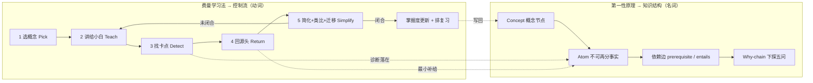
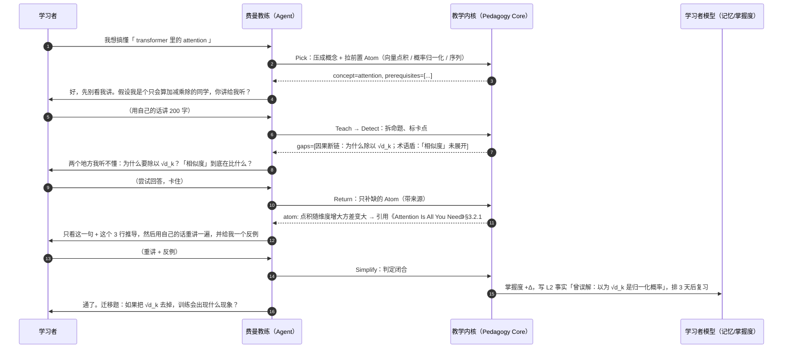

# 通用教育智能体：产品演变方向（Vision）

> 目标：把本仓库的智能体设计演变成一个**通用教育智能体**。
> 内核：**费曼学习法**（学会 = 能讲清楚）+ **第一性原理**（理解 = 能下探到不可再分的事实并重建）。
> 参考：[DeepTutor](https://github.com/HKUDS/DeepTutor)（个性化辅导 / 分层记忆 / 掌握度路径）、
> [OpenMAIC](https://github.com/THU-MAIC/OpenMAIC)（多智能体互动课堂 / 两阶段内容生成）。
> 事实依据见 [research-deeptutor-openmaic.md](./research-deeptutor-openmaic.md)。

---

## 1. 基线：我们已经有什么

不是从零开始。当前仓库里已经存在的、教育产品同样需要的东西：

| 现有能力 | 代码位置 | 对教育智能体的意义 |
|---|---|---|
| LangChain 1.x / LangGraph `create_agent` + SSE 流式对话 | `backend/app/agent.py`、`backend/app/api/chat.py` | 辅导对话的运行时已经通了，含 OpenAI 风格 chunk + `agent` 工具链事件 |
| 会话记忆（LangGraph checkpointer，SQLite / Postgres 可切） | `backend/app/agent.py:init_checkpointer` | 天然是「L1 原始学习轨迹」层，无需重造 |
| 会话元数据表 + 历史消息 API | `backend/app/models/agent_thread.py`、`backend/app/api/v1/threads.py` | 学习档案的入口（列表 / 重命名 / 删除 / 读历史） |
| **Skills 子系统**：目录即技能、三级渐进披露、RBAC 门禁、热加载 | `backend/app/skills/*`、`backend/app/middleware/agent_skills.py`、`backend/docs/skills-design.md` | 教学法与学科内容可以**不改代码**地持续扩充；也是把「费曼教练」输出到 Codex/OpenClaw 等 Agent 工作台的现成载体 |
| 按请求收敛工具子集（`request.override(tools=...)`） | `SkillMiddleware.awrap_model_call` | 直接改造成**掌握度门控**：没学会 A 就不给你 B 的工具 |
| 企业级账号体系：多身份、双 Token JWT、RBAC、Redis 会话、限流、PII 加密、审计 | `backend/app/core/*`、`backend/app/services/*` | 学生 / 家长 / 教师 / 管理员多角色，未成年人数据合规的最小化与可审计 |
| 无凭证可跑的 `MockChatModel` + 冻结外部依赖的测试套件 | `backend/app/agent.py`、`backend/tests/conftest.py` | 教学法内核必须有确定性测试路径，这套机制正好复用 |
| 前端 Ant Design X：ThoughtChain 工具链渲染、流式 Markdown、会话侧栏 | `frontend/src/app/page.tsx` | 「思考过程可视化」已有管线，可扩展成「学习证据面板」 |

**结论**：我们缺的不是脚手架，而是**教学内核**（判断学习者卡在哪、决定下一步做什么）
和**学习者模型**（跨会话的掌握度与误解库）。这两件是 DeepTutor 的强项；
而「把知识变成可互动课堂」是 OpenMAIC 的强项。两者都不是我们的护城河来源 ——
护城河来自把费曼循环做成系统的**主控制流**（见 §4）。

---

## 2. 第一性原理推导：这个产品到底是什么

先把「教育产品」拆到不可再分的事实，再从事实往上重建，而不是从竞品功能列表往下抄。

| # | 不可再分的事实 | 由此推出的产品命题 |
|---|---|---|
| F1 | 知识只有被学习者**自己重构**过才算学会；被动接收只产生熟悉感（fluency illusion） | 系统的主要产出不是「解释」，而是**逼出学习者自己的解释** |
| F2 | 学会的可验证证据只有两种：**能向他人讲清楚**、**能迁移到新情境** | 评估必须围绕「讲解 + 迁移题」，而不是「看了多久 / 点了多少」 |
| F3 | 任何复杂概念都由更小的**原子事实**与**依赖关系**构成 | 知识结构必须是 Concept / Atom DAG，不是文档目录，也不是纯向量库 |
| F4 | 学习状态是随时间变化的隐变量，只能由观测（讲解、答题、犹豫、错误）推断 | 必须有显式的**学习者模型**并持续更新；记忆是产品资产，不是缓存 |
| F5 | 同一个教学动作对不同学习者的价值符号可以相反（该追问还是该补给） | 教学策略必须条件化于「当下这个学习者的卡点类型」，因此**先诊断再动作** |
| F6 | 内容生成成本趋近于零，**判断「学会了没有」的能力才是稀缺资源** | 投资优先级：评估器 > 学习者模型 > 教学策略 > 内容生成 > 呈现层 |
| F7 | 遗忘是规律性的，掌握度会衰减 | 复习调度（间隔重复）是内核功能，不是附加功能 |

由 F1–F7 得到产品定义：

> **一个持续产出、诊断并闭合「学习证据」的智能体系统。**
> 它把每一次对话都变成可度量的理解状态变化，并用最小的教学动作推动这个变化。

这决定了我们和两个参考项目的关系：DeepTutor / OpenMAIC 解决了「辅导体验」和「课堂内容」，
我们要解决的是它们都当作软指标处理的那一层 —— **理解是否真的发生了，以及发生在哪一环**。

---

## 3. 定位

**产品名（暂定）**：Feynman Agent / 费曼教练 —— 通用教育智能体。

一句话定位：**不给你答案，先听你讲；讲不通的地方，就是你真正要学的地方。**

三个关键词：

1. **通用**（domain-agnostic）：内核与学科无关。学科知识以 Skill（`SKILL.md` + 参考资料）
   和 Atom 图的形式注入，而不是写死在提示词里。数学、物理、编程、英语、考证、企业内训共用一套循环。
2. **证据优先**（evidence-first）：系统的每个动作都要产出结构化学习证据
   （学习者原话 → 命题拆解 → 卡点标注 → 掌握度增量），可回放、可审计、可用于评估。
3. **可交付**（shippable）：每个阶段都能独立跑通、有测试、能演示，不依赖「先做完整个平台」。

目标用户（按优先级）：

| 角色 | 场景 | 我们给什么 |
|---|---|---|
| **自学者 / 学生**（C 端主用户） | 学一个新概念、准备考试、读完一本书想真正搞懂 | 费曼循环对话、卡点诊断、迁移题、复习队列 |
| **家长** | 想知道孩子到底会了没有，而不是「今天学了 30 分钟」 | 掌握度报告（RBAC 门禁 + PII 最小化） |
| **教师 / 培训师**（B 端放大器） | 备课、生成可互动课堂、看班级共性卡点 | 课堂生成（借 OpenMAIC）、班级掌握度热力图、教学法技能库 |
| **管理员 / 平台方** | 合规、成本、质量 | 已有的 RBAC / 审计 / 限流 / 可观测性 |

---

## 4. 两个内核在产品里的分工

这是本方向最重要的一张表：**费曼学习法是控制流，第一性原理是数据结构。**
两者都不是「提示词技巧」，而是落在代码里的状态机与图结构（详见 [pedagogy-core.md](./pedagogy-core.md)）。

### 4.1 费曼学习法 → 五态循环（系统的主控制流）

| 状态 | 学习者做什么 | 系统做什么 | 系统**不做**什么 |
|---|---|---|---|
| Pick 选概念 | 说出想搞懂的东西 | 把目标压成一个可命名的概念，列出前置概念与范围边界 | 不直接开讲 |
| Teach 讲解 | 用自己的话讲给「小白」听 | 扮演好奇外行，只问「这是什么意思 / 为什么」，收集原话 | 不纠错、不打断、不给术语 |
| Detect 诊断 | 回答追问 | 把讲解拆成命题，标注四类卡点，输出 gap 报告（不是分数） | 不评价「你真棒」 |
| Return 回源头 | 读/看最小必要材料 | 只补这一步缺的 Atom，带来源引用 | 不整章重讲 |
| Simplify 简化 | 用更短的话 + 自己的类比 + 一个反例重讲，再做迁移题 | 判定是否闭合；闭合则更新掌握度并排复习，未闭合回到 Teach | 不放水，也不无限追问 |

关键约束（写进内核，不是写进提示词就算）：

- **学习者说话占比 ≥ 50%**：一场辅导里学习者产出的 token 少于系统的一半，判定为「讲解失败」，
  这是可自动度量的护栏指标（`learner_talk_ratio`）。
- **追问预算**：单轮最多 N 个追问（默认 3），预算耗尽必须给出结论或补给，避免「审问式疲劳」。
- **不直接给答案**：Detect/Return 阶段禁止输出完整答案，只允许输出「缺哪个 Atom + 从哪看」。
  只有学习者显式请求「直接告诉我」并确认后，才切到直答模式，且该次不记为掌握证据。

### 4.2 第一性原理 → Atom / Concept DAG（系统的数据结构）

- **Atom（知识原子）**：一个不可再分的最小命题，形如「电压 = 单位电荷的电势能差」，
  带 `source`（可溯源引用）、`verified` 标记、`depends_on` 边。
- **Why-chain（下探五问）**：对学习者或材料中的任何断言连续追问「这依赖什么？」，
  直到落到定义 / 公理 / 可观测事实为止；下探深度与落点类型是**理解深度的直接度量**。
- **卡点 = DAG 上的断点**：诊断结果不是「错了」，而是「从 Atom X 到 Atom Y 的边缺失」或
  「引用了未验证的 Atom Z」。这让反馈天然可执行，也让掌握度可按子图计算。
- **反类比原则**：鼓励学习者用自己的类比，但系统必须同时索取一个**反例/边界**
  （「这个类比在什么情况下会失效？」）—— 类比帮助理解，边界防止误解固化。

为什么这套结构值得投资：它同时解决了三个竞品级难题 ——
出题（从 Atom 依赖边自动生成变式题）、复习（按子图掌握度 + 遗忘曲线调度）、
可解释报告（家长/教师看到的是「哪几条边没通」，而不是一个分数）。

---

## 5. 参考项目：借什么，不借什么

详细事实与链接见 [research-deeptutor-openmaic.md](./research-deeptutor-openmaic.md)。

| 能力维度 | DeepTutor 的做法 | OpenMAIC 的做法 | 我们的取舍 |
|---|---|---|---|
| 辅导对话 | Chat / Ask Questions / Solve，引用溯源（citation-grounded） | AI 老师自由问答 + 白板讲解 | **借 DeepTutor**：答案必须可溯源；载体沿用本仓库 SSE chat |
| 学习者记忆 | 三层记忆：L1 轨迹 / L2 事实 / L3 综合 + Memory Graph 连接证据 | 基本没有（课堂是一次性产物） | **必做，且是我们的资产核心**：L1 复用 checkpointer，L2/L3 新建表 |
| 掌握度与路径 | Mastery Path（按掌握度门控工具与内容） | 无 | **必做**：用 Concept DAG + `SkillMiddleware` 同款工具收敛机制实现门控 |
| 出题与判分 | 难度校准的题目生成（difficulty-calibrated）、Quiz | Quiz 场景 + AI 实时判分 | **必做，但判分要带归因**：输出「卡在哪个 Atom」而不是「扣 2 分」 |
| 内容呈现 | Book / Immersive Reading / Visualize / YouTube 学习 | Slides + TTS + 白板 + 交互 HTML + PBL + MP4 导出 | **分期**：P2 才做；先做 Markdown 讲义 / 卡片 / 文本白板，重呈现后置 |
| 多智能体 | Subagents / Partners（外接 Claude Code、Codex 等 harness） | AI 老师 + AI 同学 + LangGraph「导演图」编排 | **借 OpenMAIC 的导演图思路**，但轻量实现：LangGraph 子图 + persona skill，不做完整回放引擎 |
| 知识检索 | 多引擎 RAG（LlamaIndex / PageIndex / GraphRAG / LightRAG / WeKnora / Obsidian） | 文档解析 + web search | **先最小可用**：文档 → Atom 抽取 + 向量检索；引擎做成可插拔，后期可接 LightRAG/GraphRAG |
| 技能生态 | EduHub 社区技能 + MCP + CLI apps | `SKILL.md` 技能包，可被 Codex / OpenClaw / WorkBuddy 调用 | **我们的现成优势**：已有 skills 子系统 + RBAC + 热加载，直接长成「教学法/学科技能库」，并对外发布 skill 包 |
| 评估 | TutorBench + profile-driven student simulator（LLM 第一人称交互式评测） | AIME（AI-MOOC Exam）、MAIC-Bench | **必做**：没有 LearnerSim 就无法迭代教学策略（P0 就要有雏形） |
| 账号与合规 | learner / guardian 账号 | ACCESS_CODE 站点口令 | **我们的现成优势**：RBAC + PII 加密 + 审计直接支撑学生/家长/教师与未成年人合规 |
| 部署形态 | pip 包 + CLI + Docker，本地优先 | Next.js Web + Docker + Vercel + Postgres 持久化 | 沿用本仓库：FastAPI 后端 + Next.js 前端 + compose 一键起 |

**不借（明确不做）**：

- OpenMAIC 的 MP4 视频渲染服务（Chromium + FFmpeg 独立容器）、3D / 游戏引擎级交互场景；
- DeepTutor 的「外接十几种 coding CLI harness」「IM 多通道常驻伙伴」这类**通道扩张**；
- 自建 TTS / ASR / 图像 / 视频生成模型栈（需要时接第三方，不进内核）；
- 通用 MOOC 内容库 / 题库爬取（内容不是护城河，且版权与质量成本高）。

理由：这些都是**呈现层与通道层**，边际投入大、可替代性强，且会稀释我们在
「诊断与证据」这一层的投资（F6）。等内核被验证后再按需外接。

---

## 6. 差异化护城河

对比之后，我们的位置很清晰：

- DeepTutor 强在**个性化辅导 + 分层记忆**，弱在「学习者是否真的重建了知识」仍以对话质量间接衡量；
- OpenMAIC 强在**课堂内容生成 + 多智能体呈现**，弱在学习者模型（课堂是一次性产物）；
- 我们的差异点：**把费曼循环与第一性原理下探做成主控制流与主数据结构**，
  于是每一次交互都产出可判定、可回放、可聚合的**学习证据**。

由此得到三个别人难以快速跟进的东西：

1. **卡点分类学 + 归因判分器**：四类卡点（术语盾 / 因果断链 / 类比失配 / 边界缺失）
   × Atom DAG 定位，形成「错在哪一环」的机器可读结论。数据积累越多越准。
2. **可验证的掌握度账本**：掌握度必须绑定证据（哪次讲解、哪道迁移题、哪条 Atom 边），
   可审计、可回滚、可给家长看。这是「分数」到「账本」的差别。
3. **教学法即技能包**：教学法与学科内容以 `SKILL.md` 形式发布，
   既能被本系统热加载，也能被 Codex / OpenClaw 等 Agent 工作台调用 ——
   教学内核变成可分发的标准件（借 OpenMAIC 的分发思路 + 我们已有的 skills 工程）。

---

## 7. 核心用户旅程

### 7.1 学一个新概念（C 端主线，P0 就要跑通）

### 7.2 考前复习（P1）
学习者打开「今日复习队列」→ 系统按遗忘曲线 + 子图掌握度给出 5 个待重讲概念 →
每个概念用 90 秒口述/打字重讲 → 只对有退化的做下探 → 报告「今天闭合了 4/5，第 3 个卡在 X 边」。

### 7.3 教师备课与班级洞察（P2–P3）
教师上传讲义 / 指定主题 → 两阶段生成课堂（大纲 → 场景：讲义页 / 测验 / 白板推导 / 讨论）→
课堂里 AI 同学负责提问与抬杠，教师负责把关 → 课后系统汇总班级共性卡点
（「32% 的学生在同一条 Atom 边上断裂」）→ 反哺下一次备课。

---

## 8. 度量：北极星与护栏

没有度量的教育产品只能靠感觉迭代（F6）。指标分三层，全部可从结构化证据自动算出：

**北极星（学习是否发生）**

| 指标 | 定义 | 目标 |
|---|---|---|
| Explanation Coverage | 学习者自己产出的解释性 token 占会话总 token 比 | ≥ 50% |
| Gap Closure Rate | 一次费曼循环内闭合的卡点数 / 检出卡点数 | ≥ 70% |
| Transfer Lift | 循环后迁移题正确率 − 循环前 | ≥ +20pt |
| D7 Retention | 7 天后重讲仍能闭合的概念比例 | ≥ 60% |

**教学质量（诊断是否可信）**

| 指标 | 定义 | 目标 |
|---|---|---|
| 判分一致率 | 自动归因 vs 人工标注（Cohen's κ） | ≥ 0.6 |
| 溯源率 | 进入掌握度计算的 Atom 中带可核验来源的比例 | 100%（未溯源不计入） |
| Why-chain 深度 | 平均下探层数 / 落点是否为定义或公理 | 监控趋势 |

**系统质量与护栏**

- 首 token 时延 < 2s（沿用现有 SSE）；单次循环总成本可预算、可观测。
- **直答率**：未经学习者请求就给出完整答案的比例 → 必须趋近 0。
- **教师独白长度**：单条系统消息上限（默认 800 字），超限视为设计缺陷。
- 未成年人数据最小化：画像只存学习相关字段，家长可申请导出与删除（复用 PII 加密 + 审计）。

---

## 9. 风险与对策

| 风险 | 表现 | 对策 |
|---|---|---|
| LLM 判分不稳 | 同一份讲解两次评分不同 | 结构化 rubric（四类卡点 + Atom 定位）+ 温度 0 + 关键结论双评 + 人工抽样回流 |
| 幻觉污染知识图 | 编造的 Atom 进入掌握度计算 | 未溯源 Atom 标 `verified=false`，只做提示不做记账；溯源率作为硬指标 |
| 学习者被问烦 | 追问变成审问，用户流失 | 追问预算 + 情绪/放弃信号检测 → 自动降级为「先补给再问」；直答逃生舱永远可用 |
| 教学法与学科耦合 | 换个学科就要改代码 | 内核学科无关，学科内容一律走 Skill + Atom 图数据，禁止写进 system prompt |
| 内容呈现军备竞赛 | 被拖去做 3D / 视频 / TTS | 明确「不做清单」（§5），呈现层用可导出 DSL + 外接渲染 |
| 合规 | 未成年人数据、家长知情权 | 复用现有 RBAC + PII 加密 + 审计；报告类接口一律走权限点门禁 |
| Mock 与真实模型行为差异 | 测试绿但线上不对 | 教学内核的状态机与判分接口必须能在 `MockChatModel` 下确定性跑通，真实模型只影响文本质量 |

---

## 10. 演进概览

四个阶段，每阶段独立可交付、可演示、有测试；细节与验收标准见
[education-agent-roadmap.md](./education-agent-roadmap.md)。

| 阶段 | 主题 | 一句话交付 | 借鉴来源 |
|---|---|---|---|
| **P0** | 教学内核 MVP | 一次完整的费曼循环：讲 → 诊断四类卡点 → 最小补给 → 重讲 → 记账，全流程有测试 | 自研（内核） |
| **P1** | 学习者模型与掌握度 | 三层记忆 + Atom/Concept DAG + 遗忘曲线复习队列 + 掌握度门控 + 归因判分 | DeepTutor（记忆 / Mastery Path / 难度校准出题） |
| **P2** | 多智能体课堂 | 导演图编排的老师 + 小白同学 + 抬杠同学，两阶段生成课堂 DSL 并渲染 | OpenMAIC（导演图 / 两阶段生成 / 场景类型） |
| **P3** | 资产、生态与评估闭环 | 文档视频 → Atom 抽取，学科技能库，LearnerSim 评测，教师/家长视图，对外 skill 包 | DeepTutor（TutorBench 式评测 / 多引擎 RAG）+ OpenMAIC（SKILL.md 分发） |

阶段之间的关系：**P0 是全部价值的最小证明**（能诊断出卡点并闭合它）；
P1 把单次循环变成跨会话资产；P2 把单人循环变成多人课堂；P3 把系统变成平台。
如果 P0 的 Gap Closure Rate 与人工一致率不达标，就不应进入 P2 的内容军备竞赛。
