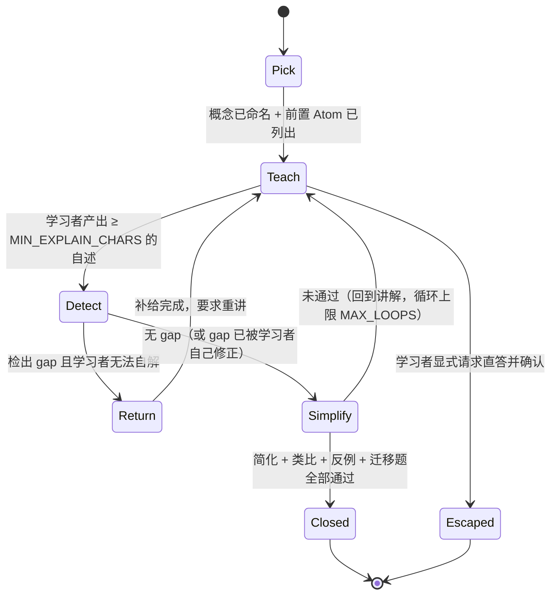

# 教学法内核规格（Pedagogy Core）

本文把「费曼学习法 + 第一性原理」从口号变成**机器可执行的规格**：状态机、数据结构、
判分 rubric、提示词契约、事件契约、可测性。它是 [education-agent-vision.md](./education-agent-vision.md) §4 的展开，
也是 [education-agent-architecture.md](./education-agent-architecture.md) 中 `app/pedagogy/` 模块的需求说明。

设计信条（按优先级）：

1. **教学法是控制流，不是提示词。** 提示词只能「建议」模型这么做；状态机才能「保证」它这么做，
   并且能被测试。凡是可以被断言的规则，都不允许只写在 prompt 里。
2. **诊断优先于动作。** 没有 gap 报告就不允许产生教学动作（补给 / 出题 / 推进）。
3. **一切结论可溯源。** 进入掌握度账本的每条事实都要能回答「凭什么这么说」。
4. **内核学科无关。** 学科内容只能通过 Skill（`SKILL.md`）与 Atom 图数据进入，禁止硬编码。
5. **确定性可测。** 在 `MockChatModel` 下，状态机的每一次转移都必须可复现、可断言。

---

## 1. 费曼循环状态机

### 1.1 状态与转移



| 状态 | 进入条件 | 退出产物 | 预算 |
|---|---|---|---|
| `Pick` | 学习者表达学习目标 | `concept`（一句话命名）+ `scope`（不讨论什么）+ `prerequisites[]` | 1 轮 |
| `Teach` | 概念已命名 | `explanation_turn`（学习者原话，未加工） | 学习者 ≥ 80 字（`MIN_EXPLAIN_CHARS`） |
| `Detect` | 收到一份讲解 | `gap_report`（结构化卡点列表，含 Atom 定位） | 每轮追问 ≤ 3（`MAX_PROBES_PER_TURN`） |
| `Return` | 有未闭合 gap | `atom_bundle`（最小必要 Atom + 来源引用，≤ 3 条） | 单次补给 ≤ 600 字 |
| `Simplify` | gap 已补给 | 简化重讲 + 学习者自造类比 + 一个反例 + 1 道迁移题 | 循环上限 `MAX_LOOPS=3` |
| `Closed` | 迁移题通过 | 掌握度增量写账本 + 复习排期 | — |
| `Escaped` | 学习者要求直答 | 记录为「未产生掌握证据」，不加分，可事后补测 | — |

**状态机的宿主**：不放提示词，放服务端。一次 `/api/chat` 请求 = 状态机的一次 tick；
状态随 `thread_id` 持久化（与 checkpointer 同源，见 architecture §5）。
Agent 只负责生成自然语言，**状态转移由内核裁决**。

### 1.2 硬护栏（可自动断言）

| 护栏 | 规则 | 违规处理 |
|---|---|---|
| `learner_talk_ratio` | 一次循环内学习者 token / 总 token ≥ 0.5 | 记为教学质量事件，触发策略降级（少讲多问） |
| `no_direct_answer` | `Detect`/`Return` 状态下系统输出不得包含完整解题步骤 | 内核拦截：截断并改写为「缺哪个 Atom」 |
| `probe_budget` | 单轮追问 ≤ 3 | 第 4 个追问被抑制，转为补给或结论 |
| `monologue_cap` | 单条系统消息 ≤ 800 字 | 超出部分转为附件/卡片，不塞进对话 |
| `escape_hatch` | 学习者说「直接告诉我」→ 必须确认后直答 | 直答不记掌握度，并提示可事后补测 |

---

## 2. 学习证据的最小单元

内核的一切输入输出都是**证据**，证据必须是结构化的、可回放的。

### 2.1 ExplanationTurn（学习者的一次自述）

```json
{
  "id": "exp_01HXXX",
  "thread_id": "…",
  "account_id": 42,
  "concept_id": "attention-scaled-dot-product",
  "loop_index": 2,
  "state": "Detect",
  "raw_text": "就是把 query 和每个 key 做点积，然后 softmax，再乘 value……除以根号 d_k 是为了缩放。",
  "chars": 61,
  "claims": [
    {"id": "c1", "text": "query 与每个 key 做点积", "atom_ref": "atom:dot-product-similarity", "status": "supported"},
    {"id": "c2", "text": "softmax 得到权重", "atom_ref": "atom:softmax-normalization", "status": "supported"},
    {"id": "c3", "text": "除以 √d_k 是为了缩放", "atom_ref": null, "status": "unsupported",
     "gap_type": "causal_gap", "note": "只说了『缩放』，没说为什么需要缩放"}
  ],
  "jargon_terms": ["query", "key", "value", "softmax"],
  "analogy": null,
  "counterexample": null,
  "created_at": "2026-09-08T12:00:00+08:00"
}
```

`claims[].status ∈ {supported, unsupported, wrong, jargon_shield, vague}` —— 由判分器给出，必须附理由。

### 2.2 GapReport（诊断结论，不是分数）

```json
{
  "explanation_id": "exp_01HXXX",
  "gaps": [
    {
      "type": "causal_gap",
      "claim_id": "c3",
      "missing_edge": {"from": "atom:dot-product-variance-grows-with-dim", "to": "atom:scaling-by-sqrt-dk"},
      "probe": "如果把 √d_k 去掉，softmax 的输出会变得多『尖』？为什么这会伤害训练？",
      "supply": {"atoms": ["atom:dot-product-variance-grows-with-dim"], "max_chars": 300},
      "severity": 2
    }
  ],
  "scores": {"completeness": 0.6, "own_words": 0.4, "boundary_awareness": 0.0},
  "learner_talk_ratio": 0.62,
  "verdict": "not_closed"
}
```

**关键设计**：`gaps[]` 的每一项都自带 `probe`（下一步该问什么）与 `supply`（该补哪个 Atom）。
诊断结果因此是**可执行的**，而不是一句「理解不够深入」。

---

## 3. 卡点分类学（四类断裂）

这是本产品的核心 IP。分类必须**互斥且可操作**：每类都有明确的检测信号与教学动作。

| 类型 | 中文 | 一句话定义 | 检测信号 | 教学动作 |
|---|---|---|---|---|
| `jargon_shield` | 术语盾 | 用术语解释术语，术语本身未被展开 | 讲解中出现学科术语但该术语无对应 Atom 或从未被学习者展开；把术语替换成「某个东西」后句子不成立 | 指名一个术语，要求「不许用这个词，重说一遍」 |
| `causal_gap` | 因果断链 | 步骤正确但「为什么可以这样」缺失 | 出现「然后就」「所以」但前后命题在 Atom DAG 上没有 `entails` 边；能复述流程不能解释原因 | 追问一步 Why-chain；补中间 Atom |
| `broken_analogy` | 类比失配 | 类比在关键属性上与被解释物不一致 | 学习者类比映射到的属性与 Atom 的依赖结构冲突 | 不否定类比，而是索取「这个类比在哪里会失效」 |
| `no_boundary` | 边界缺失 | 说不出适用条件、反例、失效场景 | 无法给出反例；把特例当通则；对「什么时候不成立」沉默 | 给一个近似的错误情境，请学习者判断对错并说理由 |

补充状态（不算卡点，但影响记账）：

- `vague`：语句无法判定真伪（「差不多就是那种感觉」）→ 要求具体化，不计入掌握度。
- `wrong`：与已验证 Atom 冲突 → 记为 misconception（误解库，P1 起是重要资产，
  因为它可跨会话复用、可做班级共性分析）。

**判分 rubric（温度 0，结构化输出）**：三个维度各 0–1，理由必填：

1. `completeness` 必要 Atom 覆盖率（缺哪条边）；
2. `own_words` 自述程度（术语密度与句式是否与材料原文高度重合）；
3. `boundary_awareness` 边界意识（反例 / 失效条件 / 单位与量纲）。

`verdict = closed` 需要：`completeness ≥ 0.8` 且 `own_words ≥ 0.6` 且无 `wrong`、`jargon_shield` 类 gap
且迁移题通过。阈值配置化（`PEDAGOGY_*`），不写死。

---

## 4. 第一性原理下探（Why-chain）与 Atom 图

### 4.1 Atom Schema

```json
{
  "id": "atom:dot-product-variance-grows-with-dim",
  "concept_id": "attention-scaled-dot-product",
  "statement": "两个 d 维随机向量的点积，其方差随 d 线性增长",
  "kind": "derivable",            // definition | axiom | observable | derivable
  "depends_on": ["atom:variance-of-sum", "atom:dot-product-definition"],
  "entails": ["atom:scaling-by-sqrt-dk"],
  "source": {"title": "Attention Is All You Need", "locator": "§3.2.1 footnote", "url": "…"},
  "verified": true,
  "difficulty": 2,                // 1–5，用于出题难度校准
  "misconceptions": ["以为是归一化概率", "以为和 batch size 有关"]
}
```

- `kind` 决定下探终点：`definition` / `axiom` / `observable` 是**可停点**，`derivable` 必须继续下探。
- `verified=false` 的 Atom 只能用于提示，**不得**参与掌握度记账（vision §9 幻觉对策）。
- `misconceptions` 是长期资产：来自真实学习者的 `wrong` 标注，回流进图。

### 4.2 Why-chain 规则

```
断言 → 问「这依赖什么？」
  ├─ 落到 definition / axiom / observable → 停止，记录 depth 与落点
  ├─ 落到 derivable → 继续下探（深度上限 WHY_CHAIN_MAX_DEPTH=5）
  └─ 学习者答不出 → 该边标记为 gap（causal_gap），进入 Return
```

**理解深度指标** = 平均下探深度 + 落点类型分布。
能一路下探到定义/公理的学习者，与在第二层就卡住的学习者，掌握度不应记为相同。

### 4.3 掌握度计算（简化、可解释、可回滚）

每条 Atom 边维护一个掌握度 `m ∈ [0,1]`，采用指数加权 + 遗忘衰减：

```
证据权重 w：closed_explanation=1.0, transfer_correct=0.8, probe_answered=0.4,
            direct_answer_read=0.0, escaped=0.0
更新：      m ← m + α · w · (1 − m)          # α 默认 0.35
衰减：      m ← m · exp(−Δt / τ)             # τ 由该 Atom 的历史表现拟合，冷启动 7 天
概念掌握度：M(concept) = Σ m(edge) · weight(edge) / Σ weight(edge)   # 关键边权重更高
```

复习调度（间隔重复）：`next_review = now + interval(m)`，`interval` 取 1 / 3 / 7 / 21 / 60 天阶梯；
复习时若闭合则升阶，若断裂则降两阶并重新进入 `Teach`。
**不做**：不引入需要大量标注数据才能拟合的复杂模型（FSRS 等）作为冷启动方案，
等账本积累到足够规模再替换（接口已隔离在 `app/pedagogy/mastery.py`）。

---

## 5. 苏格拉底约束与 persona

内核默认三个 persona，全部以 **Skill** 形式落地（`backend/skills/<name>/SKILL.md`），
而不是硬编码提示词 —— 这样教学法可版本化、可 A/B、可被外部 Agent 工作台复用：

| Persona | 职责 | 语言风格约束 | 禁止 |
|---|---|---|---|
| `feynman-listener`（小白同学） | 听讲解、只问「这是什么意思 / 为什么」 | 短句、外行词汇、每次只问一个 | 使用学科术语；给出正确答案 |
| `socratic-tutor`（教练） | 组织循环、下探 Why-chain、裁决闭合 | 明确、克制、给出下一步动作 | 一次性输出完整解法；连续追问超预算 |
| `boundary-challenger`（抬杠同学） | 索取反例、边界、失效场景 | 挑衅但友好，给具体情境 | 人身评价；无情境的空泛质疑 |

P2 的多智能体课堂在此之上加「导演」节点（见 architecture §6），persona 数量可扩展但约束表结构不变。

---

## 6. 提示词契约（与 SkillMiddleware 的关系）

现状约束必须尊重：`get_agent()` 是进程级单例，system prompt 在构造时固定；
按请求的差异只能走 `context`（`ChatContext`）与 middleware（`backend/app/middleware/agent_skills.py`）。

因此教学法的注入方式是：

```
system prompt（构造期，学科无关）
  └─ 「你是费曼教练。当前教学状态由 pedagogy_state 提供，你必须遵守它的状态与预算。」

每轮由 PedagogyMiddleware 注入（请求期，随学习者变化）
  ├─ L1 教学法目录（沿用 skills 的三级渐进披露，只放 name + description）
  ├─ pedagogy_state：当前 state / loop_index / probe_budget / open_gaps / concept 摘要
  ├─ learner_digest：L2 学习者事实摘要（语言水平、已知 misconception、上次复习结果），带 token 预算
  └─ 可用 Atom 列表（仅当前概念子图，避免上下文爆炸）
```

`ChatContext` 扩展（frozen dataclass，向后兼容）：

```python
@dataclass(slots=True, frozen=True)
class ChatContext:
    account_id: int = 0
    authenticated: bool = False
    permissions: frozenset[str] = field(default_factory=frozenset)
    # 新增（P0）：教学状态快照由 service 层从库里读出后传入，agent 内部不查库
    learner_id: int = 0
    pedagogy_state: "PedagogyState | None" = None
```

原则：**agent 不做数据库读写**，状态由 API 层装配后经 context 传入 —— 与现有 skills 的
「身份经 context 传入」完全同构，单例 agent 的约束不被破坏。

---

## 7. 事件与接口契约

### 7.1 SSE 扩展（向后兼容）

现有事件：`data: {"choices":[{"delta":{"content":"…"}}]}`，可选顶层 `agent` 字段承载工具链事件。
新增顶层 `learn` 字段，只读 delta 的客户端会自动忽略（与 `agent` 字段同一套兼容策略）：

```json
{"choices":[{"delta":{}}], "learn": {"type": "state", "state": "Detect", "loop_index": 2}}
{"choices":[{"delta":{}}], "learn": {"type": "gap", "gap_type": "causal_gap", "probe": "…"}}
{"choices":[{"delta":{}}], "learn": {"type": "atom", "id": "atom:…", "statement": "…", "source": "…"}}
{"choices":[{"delta":{}}], "learn": {"type": "mastery", "concept_id": "…", "before": 0.42, "after": 0.61,
                                     "next_review": "2026-09-11"}}
```

P2 再加 `classroom` 字段（speaker / scene / action），沿用 OpenMAIC 的「动作流」思想但保持文本优先。

### 7.2 HTTP API（草案）

| Method | Path | 说明 | 权限 |
|---|---|---|---|
| POST | `/api/v1/learning/concepts` | 建立/绑定概念，生成前置 Atom 子图 | 登录 |
| GET | `/api/v1/learning/concepts/{id}/graph` | 概念子图（Atom + 边 + 掌握度） | 本人或 `learning:report:read` |
| POST | `/api/v1/learning/explanations` | 提交一份自述 → 返回 GapReport | 本人 |
| GET | `/api/v1/learning/mastery` | 掌握度账本（含证据链接，可回溯） | 本人 |
| GET | `/api/v1/learning/review-queue` | 今日复习队列 | 本人 |
| GET | `/api/v1/learning/report?account_id=` | 家长/教师视图 | `learning:report:read`（RBAC） |
| POST | `/api/v1/classrooms` | 两阶段生成课堂（P2） | `classroom:create` |
| GET | `/api/v1/classrooms/{id}/stream` | 课堂动作流 SSE（P2） | 参与者 |

响应统一沿用 `{code, message, data}` 信封；报告类接口一律 404 而非 403（与 skills 的防枚举策略一致）。

---

## 8. 可测性：内核必须在 mock 下确定性跑通

沿用 `backend/tests/conftest.py`（MySQL/Redis/LLM 全部冻结）与 `MockChatModel` 的思路，
把「模型会说什么」与「内核怎么裁决」解耦：

| 被测对象 | 测试方式 | 示例断言 |
|---|---|---|
| 状态机转移 | 直接调用 `PedagogyLoop.tick(event)`，不经 LLM | `Teach` 收到 30 字自述 → 仍停在 `Teach`（未达 `MIN_EXPLAIN_CHARS`） |
| 卡点检测 | 判分器接口注入假模型（固定 JSON 输出） | 术语堆砌样例 → `jargon_shield`，且 `probe` 非空 |
| 护栏 | 构造超长独白 / 第 4 个追问 | 被截断 / 被抑制，并记录事件 |
| 掌握度 | 纯函数 | `m=0.5, w=1.0, α=0.35 → 0.675`；衰减单调 |
| API | httpx TestClient + 现有夹具 | 无 `learning:report:read` 访问他人报告 → 404 |
| 端到端 | `MockChatModel` 扩展一条「费曼演示脚本」 | 一句「我想搞懂 X」能跑完一次循环并写账本 |

**评估（P0 起就要有雏形，P3 完整）**：`backend/evals/learner_sim/` 提供
profile-driven student simulator（借 DeepTutor TutorBench 思路）：
给定学习者画像（先验知识、语言水平、典型误解、耐心值），模拟其在费曼循环中的回答，
用来回归教学策略 —— 策略改动是否提升了 Gap Closure Rate、是否降低了直答率。
这是唯一能在没有真实用户的情况下迭代教学法的手段。
